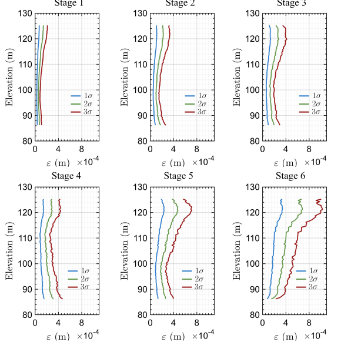

# Appendix
## Results of corner plot UQ process for Case C

## Results of corner plot UQ process for Case D

## Results of corner plot UQ process for Case E

## Results of calibrated noise for all stages for Case E
This case considers a full covariance noise calibration, which means not only modelling the noise levels but also spatial correlations.

